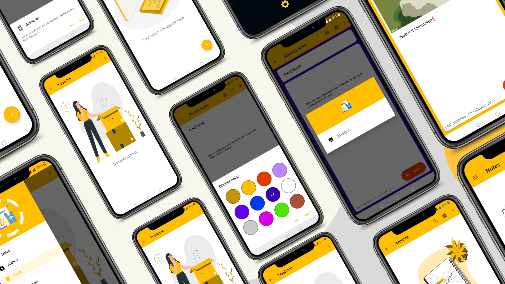
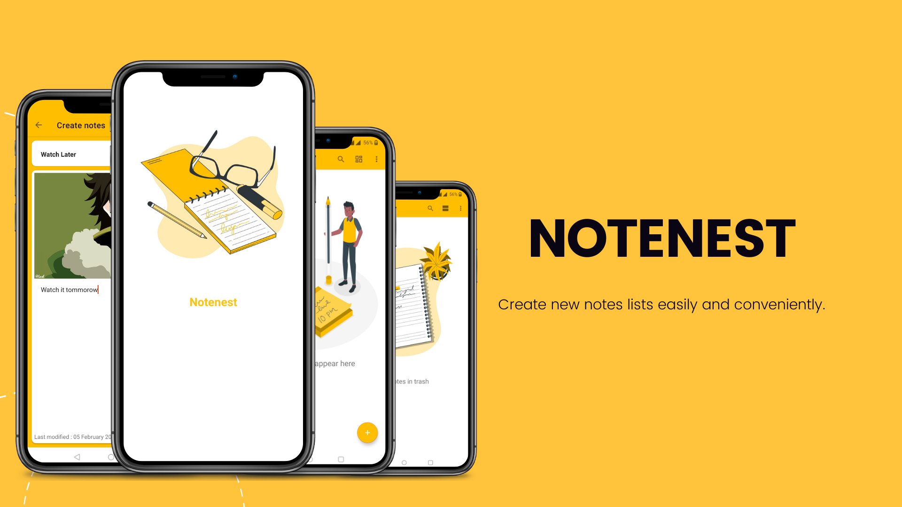
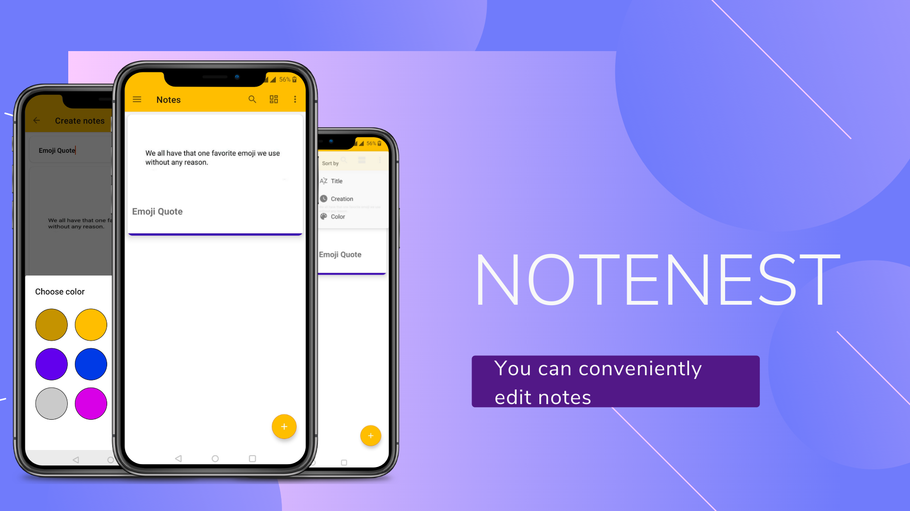
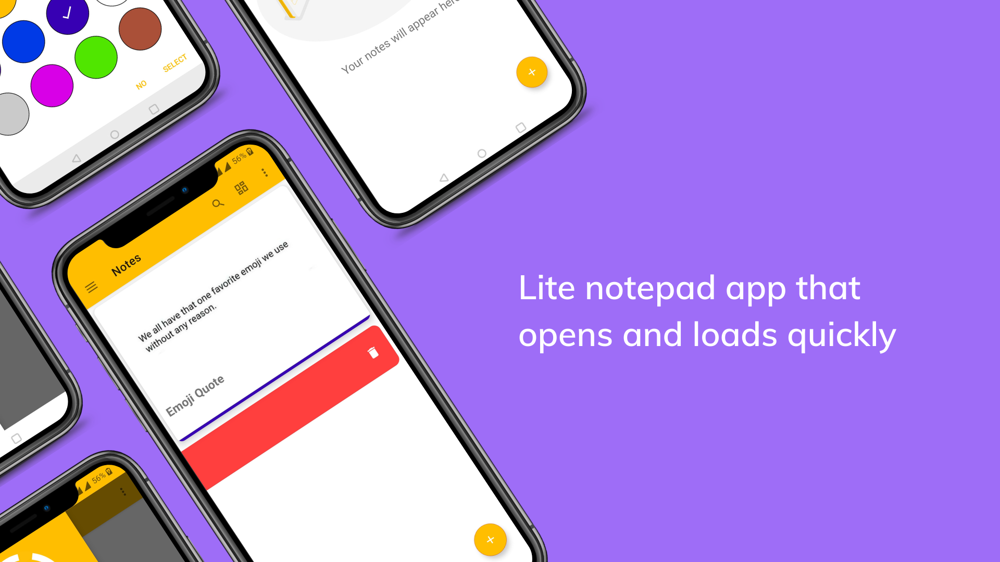

# Notenest

Notenest is an easy-to-use, intuitive, fast, elegant app to create notes Notenest has an easy to use simple interface. You can easily record thoughts and share them with friends and relatives.

## Key features
- ✔️: Save, browse, search and share notes
- ✔️: List/Grid View
- ✔️: Search for anime
- ✔️: Share notes
- ✔️: No ads
- ✔️: Easy to use
- ✔️: Record ideas, tasks.
- ✔️: No account creation required

## Technologies used
- Kotlin
- MVVM
- Dagger-hilt
- Navigation Components
- Glide
- Room database

## Screenshots

